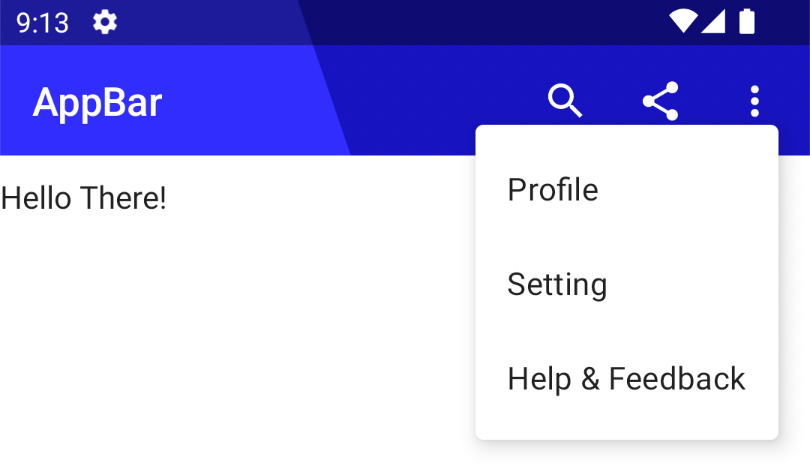

# CustomTopAppBar-JetpackCompose

This project will show you how to create a custom Top App Bar which will have a search component and drop down menu in it with a transparent Status Bar and image in the background using the power of Jetpack Compose.

Please check out my youtube channel (Developer Chunk) for more interesting content.

Tutorial of the project is uploaded here: https://youtube.com/playlist?list=PLtJj4MnnLePZEhDumCMeJsnDNJvOsuarO
